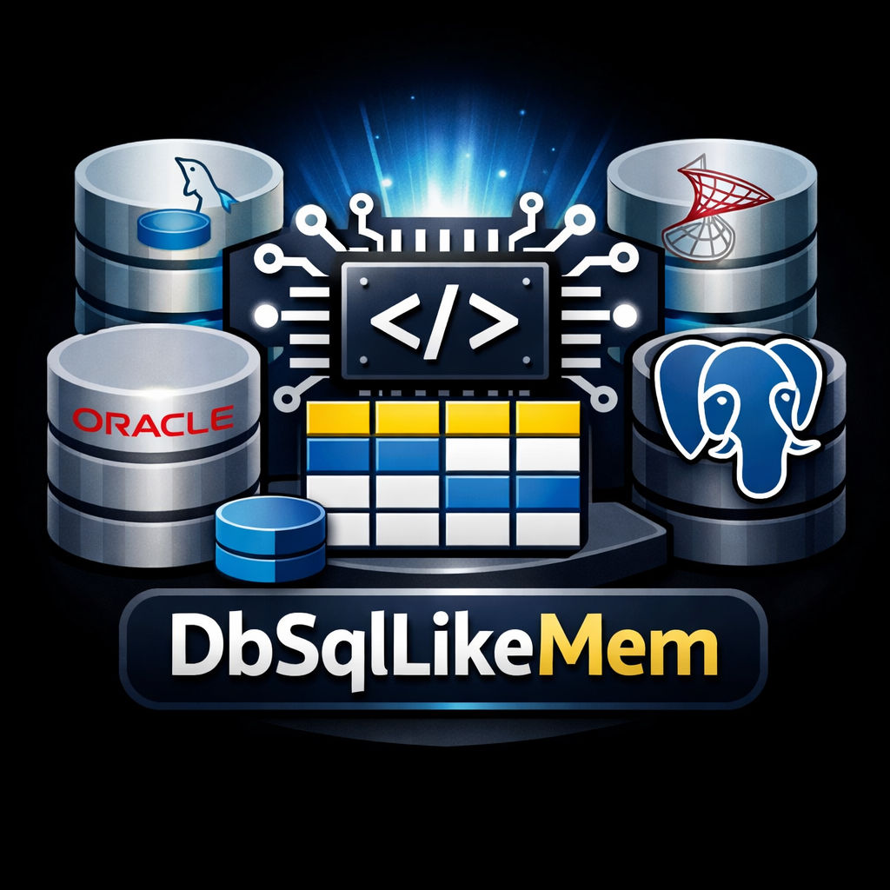

# DbSqlLikeMem

**EN:** In-memory C# database engine for unit tests that emulates SQL dialects and ADO.NET behavior for **MySQL**, **SQL Server**, **SQL Azure**, **Oracle**, **PostgreSQL (Npgsql)**, **SQLite**, and **DB2**.

**PT-BR:** Mecanismo de banco de dados em memória para testes unitários em C# que emula dialetos SQL e o comportamento de ADO.NET para **MySQL**, **SQL Server**, **SQL Azure**, **Oracle**, **PostgreSQL (Npgsql)**, **SQLite** e **DB2**.



---

## 📚 Documentation by context | Documentação por contexto

**EN:** To keep maintenance and reading easier, the main documentation is split by topic:

**PT-BR:** Para facilitar a manutenção e a leitura, a documentação principal foi separada por tema:

- [Documentation overview | Visão geral da documentação](docs/README.md)
- [Getting started (installation and usage) | Começando rápido (instalação e uso)](docs/getting-started.md)
- [Providers, versions, and SQL compatibility | Provedores, versões e compatibilidade SQL](docs/old/providers-and-features.md)
- [AI playbook for external repository/integration tests | Playbook de IA para testes de repositório/integração](docs/ai-nuget-test-projects-playbook.md)
- [Publishing (NuGet, VSIX, and VS Code) | Publicação (NuGet, VSIX e VS Code)](docs/publishing.md)
- [GitHub Wiki guide | Guia para Wiki do GitHub](docs/wiki/README.md)

> **EN:** Use this root `README.md` as your entry point and go deeper through the links above.  
> **PT-BR:** Use este `README.md` da raiz como porta de entrada e aprofunde pelos links acima.

---

## Features (summary) | Funcionalidades (resumo)

- **EN:** Support for 7 providers: MySQL, SQL Server, SQL Azure, Oracle, PostgreSQL (Npgsql), SQLite, and DB2.  
  **PT-BR:** Suporte a 7 provedores: MySQL, SQL Server, SQL Azure, Oracle, PostgreSQL (Npgsql), SQLite e DB2.
- **EN:** Provider-specific ADO.NET mocks.  
  **PT-BR:** Mocks ADO.NET específicos por provedor.
- **EN:** SQL parser + executor for common DDL/DML operations.  
  **PT-BR:** Parser + executor SQL para operações DDL/DML comuns.
- **EN:** Fluent API for schema definition and data seeding.  
  **PT-BR:** API fluente para definição de schema e seed de dados.
- **EN:** Schema-level sequences plus optional identity override for deterministic setup and dialect-aware sequence flows.  
  **PT-BR:** Sequences em nível de schema e sobrescrita opcional de identity para setup determinístico e fluxos de sequence sensíveis ao dialeto.
- **EN:** Friendly execution flow for Dapper-based tests.  
  **PT-BR:** Fluxo de execução amigável para testes com Dapper.
- **EN:** Dialect/version-specific behavior.  
  **PT-BR:** Comportamento específico por dialeto/versão.
- **EN:** Mock execution plans with runtime metrics (`EstimatedCost`, `InputTables`, `EstimatedRowsRead`, `ActualRows`, `SelectivityPct`, `RowsPerMs`, `ElapsedMs`) and per-connection history (`LastExecutionPlan`, `LastExecutionPlans`).  
  **PT-BR:** Planos de execução mock com métricas de runtime (`EstimatedCost`, `InputTables`, `EstimatedRowsRead`, `ActualRows`, `SelectivityPct`, `RowsPerMs`, `ElapsedMs`) e histórico por conexão (`LastExecutionPlan`, `LastExecutionPlans`).

**EN:** Full compatibility details are available here:  
**PT-BR:** Os detalhes completos de compatibilidade estão aqui:

- [docs/old/providers-and-features.md](docs/old/providers-and-features.md)

## When to use | Quando usar

- **EN:** Unit and integration tests that require SQL behavior without running a real database server.  
  **PT-BR:** Testes unitários e de integração que exigem comportamento SQL sem executar um servidor de banco real.
- **EN:** Fast feedback scenarios in CI/CD pipelines where deterministic setup matters.  
  **PT-BR:** Cenários de feedback rápido em pipelines CI/CD onde setup determinístico é importante.
- **EN:** Multi-dialect test suites where the same repository/service logic is validated against different providers.  
  **PT-BR:** Suítes de teste multi-dialeto onde a mesma lógica de repositório/serviço é validada em provedores diferentes.

## Scope and expectations | Escopo e expectativas

- **EN:** This project emulates major ADO.NET and SQL behaviors for tests; it is not intended to replace production databases.  
  **PT-BR:** Este projeto emula comportamentos principais de ADO.NET e SQL para testes; não substitui bancos de produção.
- **EN:** SQL support is intentionally incremental and dialect-aware; unsupported constructs throw clear exceptions.  
  **PT-BR:** O suporte SQL é incremental e sensível ao dialeto; construções não suportadas geram exceções claras.
- **EN:** Affected-rows semantics follow dialect conventions where applicable (for example, MySQL upsert conflict updates may report `2`).  
  **PT-BR:** A semântica de linhas afetadas segue convenções por dialeto quando aplicável (por exemplo, update em conflito no upsert MySQL pode retornar `2`).

## Quick start in 60 seconds | Começo rápido em 60 segundos

```csharp
using DbSqlLikeMem.MySql;

var db = new MySqlDbMock(version: 80);
var users = db.AddTable("users");
users.AddColumn("Id", DbType.Int32, false);
users.AddColumn("Name", DbType.String, false);
users.AddPrimaryKeyIndexes("id");

using var cnn = new MySqlConnectionMock(db);
cnn.Open();

using var cmd = cnn.CreateCommand();
cmd.CommandText = "INSERT INTO users (Id, Name) VALUES (1, 'Alice')";
cmd.ExecuteNonQuery();

cmd.CommandText = "SELECT Name FROM users WHERE Id = 1";
var name = (string?)cmd.ExecuteScalar();
// name == "Alice"
```

**EN:** For provider-specific examples (Dapper, transactions, RETURNING/OUTPUT, etc.), see: [docs/getting-started.md](docs/getting-started.md)  
**PT-BR:** Para exemplos por provedor (Dapper, transações, RETURNING/OUTPUT etc.), veja: [docs/getting-started.md](docs/getting-started.md)

## Sequence quick reference | Referência rápida de sequence

- **EN:** SQL Server: `NEXT VALUE FOR schema.seq_name`  
  **PT-BR:** SQL Server: `NEXT VALUE FOR schema.seq_name`
- **EN:** PostgreSQL: `nextval('schema.seq_name')`, `currval('schema.seq_name')`, `setval('schema.seq_name', value, is_called)`, `lastval()`  
  **PT-BR:** PostgreSQL: `nextval('schema.seq_name')`, `currval('schema.seq_name')`, `setval('schema.seq_name', value, is_called)`, `lastval()`
- **EN:** Oracle: `schema.seq_name.NEXTVAL`, `schema.seq_name.CURRVAL`  
  **PT-BR:** Oracle: `schema.seq_name.NEXTVAL`, `schema.seq_name.CURRVAL`
- **EN:** DB2: `NEXT VALUE FOR schema.seq_name`, `PREVIOUS VALUE FOR schema.seq_name`  
  **PT-BR:** DB2: `NEXT VALUE FOR schema.seq_name`, `PREVIOUS VALUE FOR schema.seq_name`

**EN:** See [docs/getting-started.md](docs/getting-started.md) for end-to-end examples.  
**PT-BR:** Veja [docs/getting-started.md](docs/getting-started.md) para exemplos end-to-end.

## Execution plan diagnostics (quick view) | Diagnóstico de plano de execução (visão rápida)

```csharp
using var cmd = cnn.CreateCommand();
cmd.CommandText = "SELECT Name FROM users WHERE Id = 1";
using var reader = cmd.ExecuteReader();

var plan = cnn.LastExecutionPlan;
// plan.EstimatedCost, plan.EstimatedRowsRead, plan.ActualRows, plan.ElapsedMs, ...
```

**EN:** Use `LastExecutionPlans` when validating a sequence of statements in a single test flow.  
**PT-BR:** Use `LastExecutionPlans` ao validar uma sequência de comandos no mesmo fluxo de teste.

## Requirements | Requisitos

- **EN:** Production core and provider packages follow the central targets in `src/Directory.Build.props`: **`net462`**, **`netstandard2.0`**, and **`net8.0`**.  
  **PT-BR:** Os pacotes de produção do núcleo e dos provedores seguem os alvos centrais de `src/Directory.Build.props`: **`net462`**, **`netstandard2.0`** e **`net8.0`**.
- **EN:** Test and test-tools projects use the dedicated override target set: **`net462`**, **`net6.0`**, and **`net8.0`**.  
  **PT-BR:** Os projetos de teste e test-tools usam o conjunto de alvos do override dedicado: **`net462`**, **`net6.0`** e **`net8.0`**.
- **EN:** Some tooling or integration-specific projects may use narrower target sets (for example, extension/tooling projects outside the main NuGet package flow).  
  **PT-BR:** Alguns projetos específicos de tooling ou integração podem usar conjuntos de alvo mais estreitos (por exemplo, extensões e ferramentas fora do fluxo principal de pacotes NuGet).

## Supported Providers | Provedores suportados

| Provider / Provedor | Package/Project / Pacote/Projeto |
| --- | --- |
| MySQL | `DbSqlLikeMem.MySql` |
| SQL Server | `DbSqlLikeMem.SqlServer` |
| SQL Azure | `DbSqlLikeMem.SqlAzure` |
| Oracle | `DbSqlLikeMem.Oracle` |
| PostgreSQL (Npgsql) | `DbSqlLikeMem.Npgsql` |
| SQLite (Sqlite) | `DbSqlLikeMem.Sqlite` |
| DB2 | `DbSqlLikeMem.Db2` |

## Simulated versions by provider | Versões simuladas por provedor

| Provider / Provedor | Simulated versions / Versões simuladas |
| --- | --- |
| MySQL | 3.0, 4.0, 5.5, 5.6, 5.7, 8.0, 8.4 |
| SQL Server | 7, 2000, 2005, 2008, 2012, 2014, 2016, 2017, 2019, 2022 |
| SQL Azure | 100, 110, 120, 130, 140, 150, 160, 170 |
| Oracle | 7, 8, 9, 10, 11, 12, 18, 19, 21, 23 |
| PostgreSQL (Npgsql) | 6, 7, 8, 9, 10, 11, 12, 13, 14, 15, 16, 17 |
| SQLite (Sqlite) | 3 |
| DB2 | 8, 9, 10, 11 |

For MySQL, documentation uses dotted versions (`8.0`, `8.4`), while the provider API keeps integer values (`80`, `84`).
Para MySQL, a documentação usa versões com ponto (`8.0`, `8.4`), enquanto a API do provider mantém valores inteiros (`80`, `84`).

## Runtime provider factory example | Exemplo de factory de provider em runtime

```csharp
using DbSqlLikeMem.Db2;
using DbSqlLikeMem.MySql;
using DbSqlLikeMem.Npgsql;
using DbSqlLikeMem.Oracle;
using DbSqlLikeMem.SqlAzure;
using DbSqlLikeMem.Sqlite;
using DbSqlLikeMem.SqlServer;

public static class DbSqlLikeMemFactory
{
    public static DbConnection Create(string provider)
    {
        return provider.ToLowerInvariant() switch
        {
            "mysql" => new MySqlConnectionMock(new MySqlDbMock()),
            "sqlserver" => new SqlServerConnectionMock(new SqlServerDbMock()),
            "sqlazure" or "azure-sql" or "azuresql" or "azure_sql" => new SqlAzureConnectionMock(new SqlAzureDbMock()),
            "oracle" => new OracleConnectionMock(new OracleDbMock()),
            "postgres" or "postgresql" or "npgsql" => new NpgsqlConnectionMock(new NpgsqlDbMock()),
            "sqlite" => new SqliteConnectionMock(new SqliteDbMock()),
            "db2" => new Db2ConnectionMock(new Db2DbMock()),
            _ => throw new ArgumentException($"Unsupported provider: {provider}")
        };
    }
}
```

## Installation and usage examples | Instalação e exemplos de uso

**EN:** See the dedicated getting-started guide:  
**PT-BR:** Consulte o guia dedicado de início rápido:

- [docs/getting-started.md](docs/getting-started.md)

**EN:** The guide includes:  
**PT-BR:** O guia inclui:

- **EN:** Project references and DLL usage.  
  **PT-BR:** Referência de projeto e uso de DLLs.
- **EN:** NuGet/dependency notes.  
  **PT-BR:** Observações de NuGet/dependências.
- **EN:** Runtime provider factory.  
  **PT-BR:** Factory de provider em runtime.
- **EN:** `InternalsVisibleTo` configuration.  
  **PT-BR:** Configuração de `InternalsVisibleTo`.
- **EN:** SQL Server and PostgreSQL examples.  
  **PT-BR:** Exemplos com SQL Server e PostgreSQL.

## Tests | Testes

```bash
dotnet test src/DbSqlLikeMem.slnx
```

**EN:** To run one test project only:  
**PT-BR:** Para executar apenas um projeto de teste:

```bash
dotnet test src/DbSqlLikeMem.SqlServer.Test/DbSqlLikeMem.SqlServer.Test.csproj
dotnet test src/DbSqlLikeMem.SqlAzure.Test/DbSqlLikeMem.SqlAzure.Test.csproj
```

## Publishing | Publicação

**EN:** Publishing documentation is available at:  
**PT-BR:** A documentação de publicação está em:

- [docs/publishing.md](docs/publishing.md)

**EN:** It includes:  
**PT-BR:** Ela inclui:

- **EN:** NuGet package publishing.  
  **PT-BR:** Publicação de pacotes no NuGet.
- **EN:** VSIX extension publishing (Visual Studio Marketplace).  
  **PT-BR:** Publicação de extensão VSIX (Visual Studio Marketplace).
- **EN:** VS Code extension publishing (Marketplace).  
  **PT-BR:** Publicação de extensão VS Code (Marketplace).

## Documentation standard (English + Portuguese) | Padrão de documentação (inglês + português)

**EN:** For open-source readability, public API documentation should be written in **two languages**:

**PT-BR:** Para melhorar a legibilidade em open source, a documentação da API pública deve ser escrita em **dois idiomas**:

- **EN:** English first (`<summary>` first sentence/paragraph in English).  
  **PT-BR:** Inglês primeiro (primeira frase/parágrafo de `<summary>` em inglês).
- **EN:** Portuguese next (second sentence/paragraph in Portuguese).  
  **PT-BR:** Português em seguida (segunda frase/parágrafo em português).

**EN:** Recommended XML doc pattern:  
**PT-BR:** Padrão recomendado de documentação XML:

```csharp
/// <summary>
/// English description.
/// Descrição em português.
/// </summary>
```

**EN:** When overriding or implementing members that already have documentation, prefer:  
**PT-BR:** Ao sobrescrever ou implementar membros que já possuem documentação, prefira:

```csharp
/// <inheritdoc/>
```

**EN:** This keeps compiler warnings visible (including `CS1591`) so missing docs are fixed instead of hidden.  
**PT-BR:** Isso mantém os avisos do compilador visíveis (incluindo `CS1591`) para que a documentação ausente seja corrigida, e não escondida.

## Contribution | Contribuição

**EN:** Contributions are welcome! If you want to improve DbSqlLikeMem, open an issue to discuss your idea or submit a pull request.

**PT-BR:** Contribuições são bem-vindas! Se você quiser melhorar o DbSqlLikeMem, abra uma issue para discutir sua ideia ou envie um pull request.

**EN:** If you want to support the project financially, use **GitHub Sponsors** ("Sponsor" button) or **Buy Me a Coffee**: <https://buymeacoffee.com/chrisulson>.

**PT-BR:** Se você quiser apoiar o projeto financeiramente, use o **GitHub Sponsors** (botão "Sponsor") ou o **Buy Me a Coffee**: <https://buymeacoffee.com/chrisulson>.

**EN:** High-impact areas:  
**PT-BR:** Áreas de alto impacto:

- **EN:** Expand SQL compatibility by dialect.  
  **PT-BR:** Expandir compatibilidade SQL por dialeto.
- **EN:** Add examples and documentation.  
  **PT-BR:** Adicionar exemplos e documentação.
- **EN:** Improve performance and diagnostics.  
  **PT-BR:** Melhorar desempenho e diagnósticos.
- **EN:** Increase test coverage.  
  **PT-BR:** Aumentar cobertura de testes.

## Documentation structure for GitHub Wiki | Estrutura de documentação para Wiki do GitHub

**EN:** If you want to publish a GitHub Wiki based on local content:  
**PT-BR:** Se você quiser publicar uma Wiki no GitHub com base no conteúdo local:

- **EN:** See the step-by-step guide in [docs/wiki/README.md](docs/wiki/README.md).  
  **PT-BR:** Veja o passo a passo em [docs/wiki/README.md](docs/wiki/README.md).
- **EN:** Ready-to-use wiki pages are available in [docs/wiki/pages](docs/wiki/pages).  
  **PT-BR:** Arquivos prontos para páginas de wiki estão em [docs/wiki/pages](docs/wiki/pages).

## License | Licença

**EN:** This project is licensed under the **MIT License**. See [LICENSE](LICENSE).

**PT-BR:** Este projeto é licenciado sob a **Licença MIT**. Veja [LICENSE](LICENSE).
